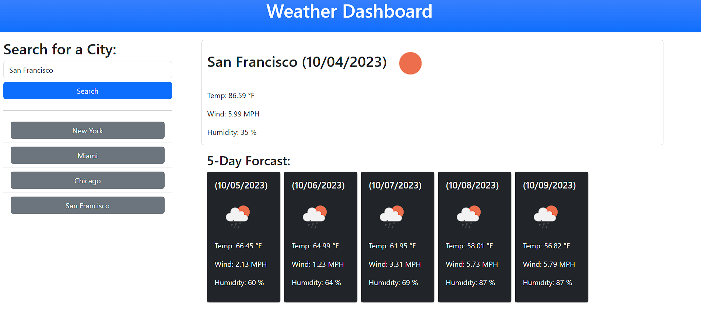

# <06 WeatherDashboard>

## Description

When I search for a city
Then I am presented with current and future weather conditions for that city and that city is added to the search history
When I view current weather conditions for that city
Then I am presented with the city name, the date, an icon representation of weather conditions, the temperature, the humidity, and the wind speed
When I view future weather conditions for that city
Then I am presented with a 5-day forecast that displays the date, an icon representation of weather conditions, the temperature, the wind speed, and the humidity
When I click on a city in the search history
Then I am again presented with current and future conditions for that city

## Table of Contents

- [Installation](#installation)
- [Usage](#usage)
- [Credits](#credits)
- [License](#license)
- [Features](#features)
- [How to Contribute](#how-to-contribute)
- [Tests](#tests)

## Installation

N/A

## Usage

Here is the link: https://gisellerx.github.io/challenge6-Weather-dashboard/

## Credits

Giselle Reyes, Professor Phil

## License

## Features

Website

## How to Contribute

Personal challenge

## Tests

Used VS Code

